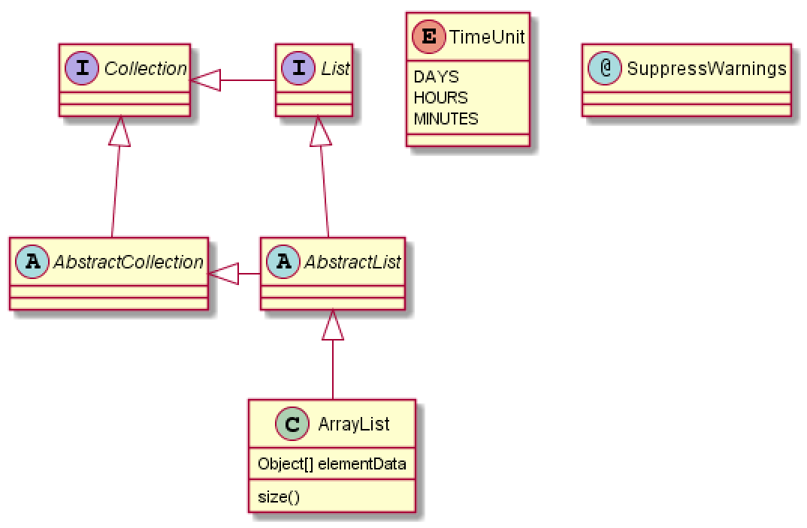

= ddd

== ddd

=== d

==== d

====
ddd
ddd

ddd
====

*dd*

_dd_

[.line-through]#ddd#

#ds#

- 111
- 222

dd

* 111
** 111
*** 11

TIP: ddd

ddd

~dd~

~dddd~~

`ddd`

https://xxx[ddd]

|===
|Header 1 |Header 2 |Header 3

|Column 1, row 1
|Column 2, row 1
|Column 3, row 1

|Column 1, row 2
|Column 2, row 2
|Column 3, row 2
|===

[tree,file="tree-view-new.png"]
--
root
|-- photos
|   |-- camp.gif
|   |-- festival.png
|   `-- balloon.jpg
|-- videos
|   |-- car-video.avi
|   |-- dance.mp4
|   |-- dance01.mpg
|   |-- another video.divx
|   `-- school videos
|       `-- firstday.flv
|-- documents
|   |-- jsfile.js
|   |-- powerpoint.ppt
|   |-- chapter-01.asc
|   |-- archive-db.zip
|   |-- .gitignore
|   |-- README
|   `-- configuration.conf
`-- etc.
--

[tree,file="tree-view-new2.png"]
--
root
|-- photos
|   |-- camp.gif
|   |-- festival.png
|   `-- balloon.jpg
|-- videos
|   |-- car-video.avi
|   |-- dance.mp4
|   |-- dance01.mpg
|   |-- another video.divx
|   `-- school videos
|       `-- firstday.flv
|-- documents
|   |-- jsfile.js
|   |-- powerpoint.ppt
|   |-- chapter-01.asc
|   |-- archive-db.zip
|   |-- .gitignore
|   |-- README
|   `-- configuration.conf
`-- etc.
--

.UML Diagram Example
[uml,file="uml-example.png"]
--
abstract class AbstractList
abstract AbstractCollection
interface List
interface Collection

List <|-- AbstractList
Collection <|-- AbstractCollection

Collection <|- List
AbstractCollection <|- AbstractList
AbstractList <|-- ArrayList

class ArrayList {
  Object[] elementData
  size()
}

enum TimeUnit {
  DAYS
  HOURS
  MINUTES
}

annotation SuppressWarnings
--

.ditaa Diagram Example
[ditaa,file="images/ditaa-example.png"]
--
    +--------+   +-------+    +-------+
    |        |---+ ditaa +--->|       |
    |  Text  |   +-------+    |diagram|
    |Document|   |!magic!|    |       |
    |     {d}|   |       |    |       |
    +---+----+   +-------+    +-------+
        :                         ^
        |       Lots of work      |
        +-------------------------+
--

[math,file="tex-formula.png"]
--
\begin{align}
\dot{x} & = \sigma(y-x) \\
\dot{y} & = \rho x - y - xz \\
\dot{z} & = -\beta z + xyp
\end{align}
--

[math,file="mathml-formula.png"]
--
<math xmlns="http://www.w3.org/1998/Math/MathML" display="block">
  <mi>x</mi>
  <mo>=</mo>
  <mrow>
    <mfrac>
      <mrow>
        <mo>&#x2212;</mo>
        <mi>b</mi>
        <mo>&#xB1;</mo>
        <msqrt>
          <msup>
            <mi>b</mi>
            <mn>2</mn>
          </msup>
          <mo>&#x2212;</mo>
          <mn>4</mn>
          <mi>a</mi>
          <mi>c</mi>
        </msqrt>
      </mrow>
      <mrow>
        <mn>2</mn>
        <mi>a</mi>
      </mrow>
    </mfrac>
  </mrow>
  <mtext>.</mtext>
</math>
--

[chart,pie,file="secim-2014-pie.png",opt="title=2014 YEREL SEÇİM SONUÇLARI"]
——
AKP，45.6，橙色
CHP，27.8，红色
MHP，15.2
BDP，4.2
SP, 2
——

[chart,area,file="area-chart.png"]
——
//四月
1、4
3、10
6、15
9、8
12、5

//可能
1, 20
3、15
6、13
9、12
12、14
——

